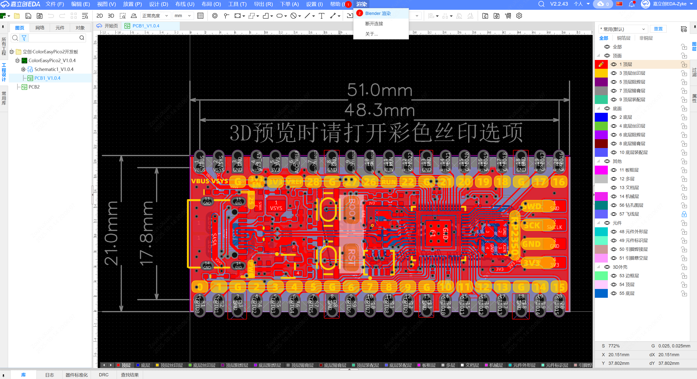

# PCB Blender Rendering Extension

An extension for EasyEDA Pro that sends PCB 3D models to Blender for high-quality rendering via WebSocket.

## Project Overview

This extension provides seamless integration between PCB design and Blender 3D rendering software, enabling you to:

- **One-Click Rendering**: Send PCB 3D models directly from EasyEDA to Blender
- **Real-time Connection**: WebSocket real-time communication with connection status monitoring
- **High-Quality Rendering**: Leverage Blender's powerful rendering engine to create professional-grade PCB visualizations
- **Automated Processing**: Automatically import PCB models and set up Blender scenes

## Environment Setup

### 1. Install Extension and Enable External Interaction

- Import this extension's eext file in Settings > Extensions > Extension Manager, enable it and allow external interaction.

  

### 2. Install Blender 4.5

- Download and install Blender 4.5 from the [official Blender website](https://www.blender.org/download/).

## Usage Instructions

#### Step 1: Start Blender Service

1. Use archive software to open the downloaded extension file and extract the pcb_importer_websocket.py script from the script directory.
2. Open Blender.
3. Click on "Scripting" in the top menu bar, open the extracted script in the script editor and run it.
   
4. Running the script will automatically install library files and wait for EasyEDA connection.
   
#### Step 2: Use in EDA

1. Open your PCB project in EasyEDA.
2. Click **Render** → **Blender Render** in the top menu bar to start connection.
   
3. After successful connection, files will be automatically pushed to Blender.
   

#### Step 3: Complete Rendering in Blender

1. After model import is complete, the following will be automatically adjusted in Blender:
   - Materials and textures
   - Lighting settings
   - Camera angles
  
2. After adjusting materials and lighting, press F12 to render the image.
