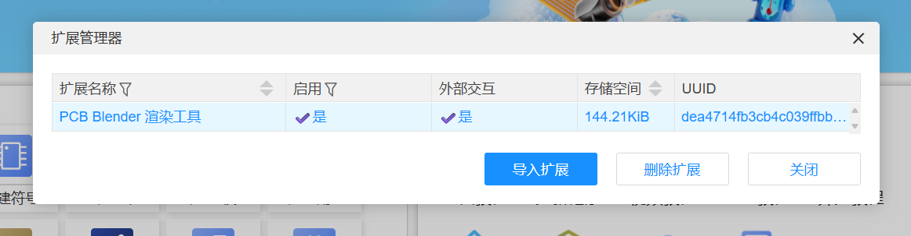
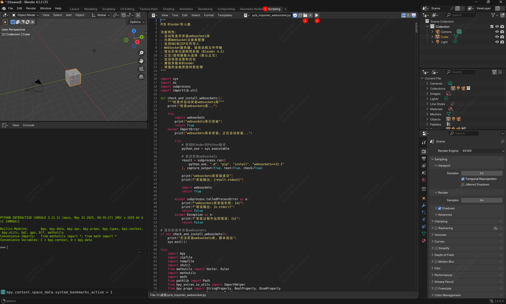
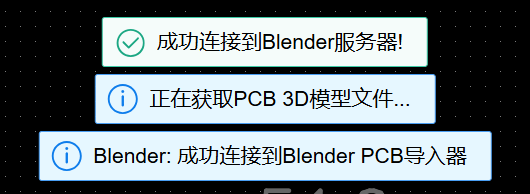

# PCB Blender 渲染扩展

一个用于嘉立创EDA专业版的扩展，通过 WebSocket 将 PCB 3D 模型发送到 Blender 进行高质量渲染。

## 项目简介

本扩展实现了 PCB 设计与 Blender 3D 渲染软件的无缝集成，让您能够：

- **一键渲染**: 直接从嘉立创EDA将PCB 3D模型发送到Blender
- **实时连接**: WebSocket实时通信，支持连接状态监控
- **高质量渲染**: 利用Blender强大的渲染引擎制作专业级PCB效果图
- **自动化处理**: 自动导入PCB模型并设置Blender场景

## 环境准备

### 1. 安装扩展并开启外部交互

- 在设置-扩展-扩展管理器中导入本扩展的eext扩展文件,启用并允许扩展外部交互。

  

### 2. 安装 Blender 4.5 

- 从 [Blender 官方网站](https://www.blender.org/download/) 下载并安装 Blender 4.5 版本。

## 使用步骤

#### 步骤 1：启动 Blender 服务

1. 下载导入脚本：[链接下载](https://internal-api-drive-stream.feishu.cn/space/api/box/stream/download/all/XUGeb6Fluou73bxhAtlc7Afhneh/?mount_node_token=QRg4dqhJ3oFEsRxGJbfcMDubn5g&mount_point=docx_file) 或  [Github](https://github.com/easyeda/eext-pcb-render-with-blender/blob/main/script/pcb_importer_websocket.py)
2. 打开 Blender。
3. 在顶部菜单栏点击 Scripting,在脚本编辑器打开解压的脚本并运行。
   
4. 运行脚本将自动安装库文件并等待嘉立创EDA连接。
   
#### 步骤 2：在 EDA 中使用

1. 在嘉立创EDA中打开您的PCB项目。
2. 在顶部菜单栏点击 **渲染** → **Blender 渲染** 开始连接。
   
3. 连接成功后将自动推送文件到 Blender。
   

#### 步骤 3：在 Blender 中完成渲染

1. 模型导入完成后，将在 Blender 中自动调整：
   - 材质和纹理
   - 光照设置
   - 相机角度
  
2. 调整好材质和光照后按快捷键 F12 进行图像渲染。

